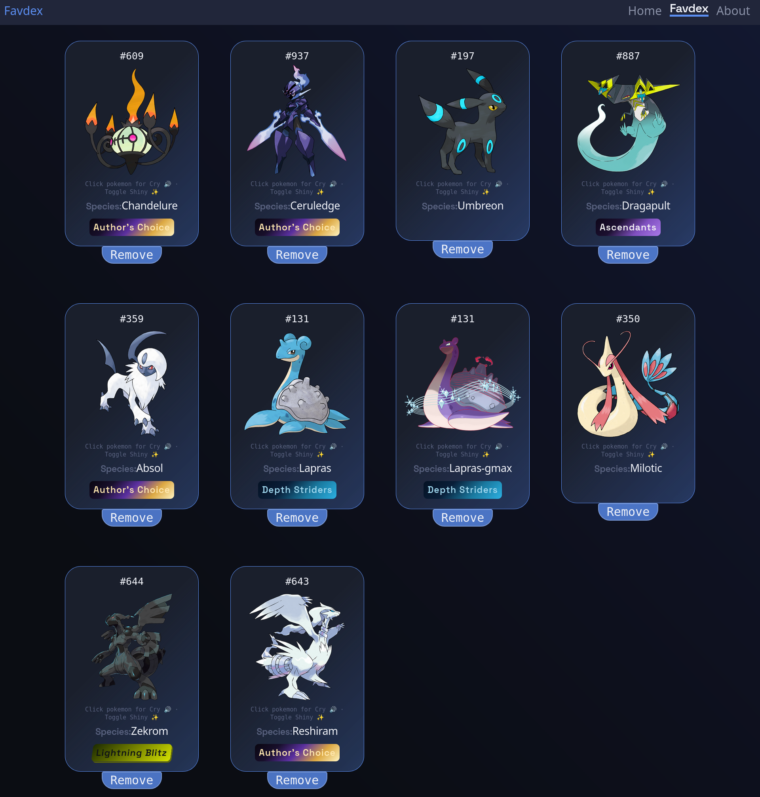
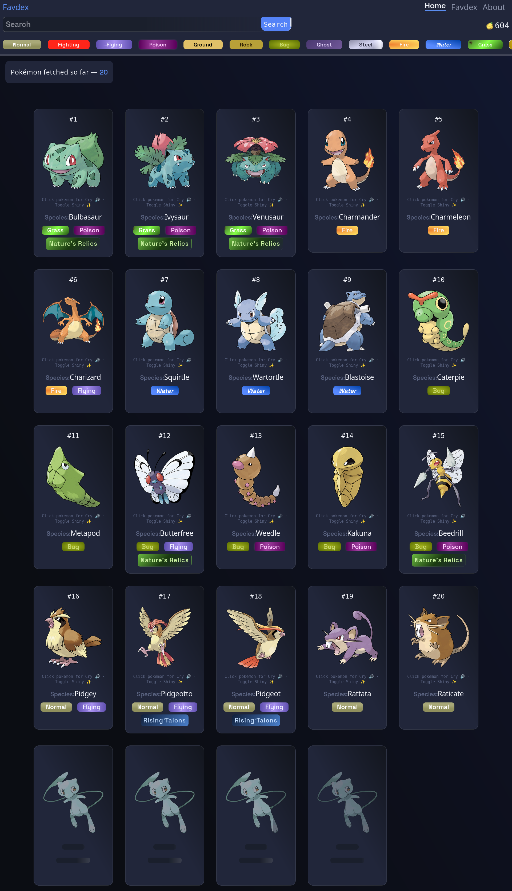
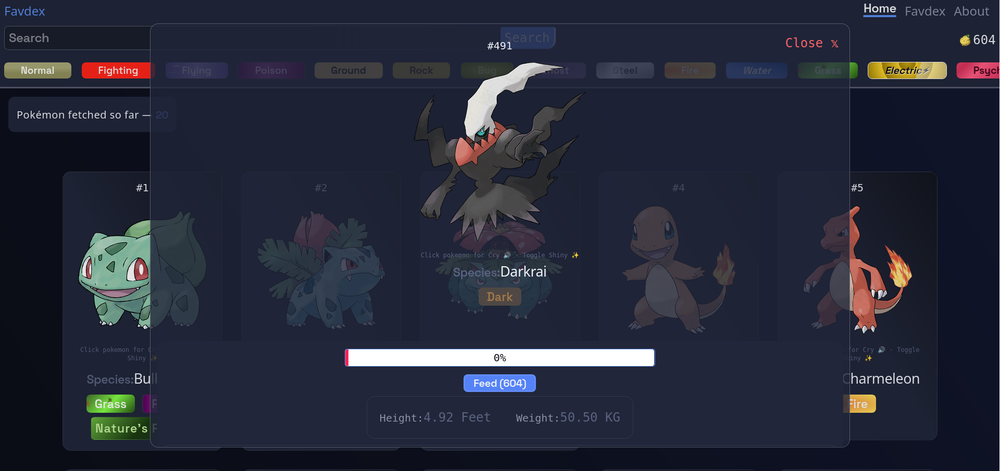
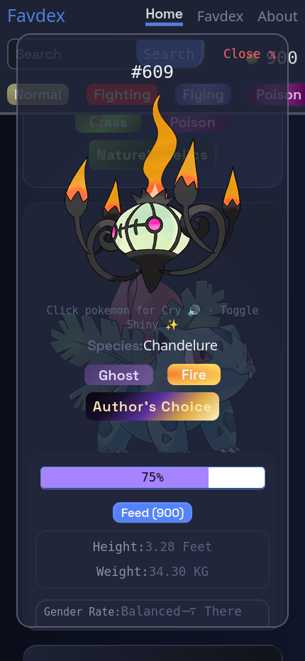

# Favdex

A Pokédex that cares about design. Built with React and PokéAPI.

**[Live Demo →](https://favdex.vercel.app)**

---

## Features

### Search & Discovery
- Search any Pokémon by **name or Pokédex ID**
- **Smart suggestions** — type a letter and get up to 4 name completions, click to search instantly
- Already-fetched Pokémon are **cached in localStorage** — no redundant API calls on revisit
- **Filter fetched Pokémon by type** — fast, client-side, no extra fetch

### Viewer
- Toggle between **official, dreamworld, and pixel sprites** (experimental)
- Switch between **normal and shiny** variants on image click
- Plays the **Pokémon's cry** on detail open
- **Custom flavour text** for gender rates, habitats, catch rate, and base happiness — no raw data dumps

### Tags
- Pokémon are automatically tagged based on their data — e.g. Bulbasaur gets *Nature's Relic*, Pidgeotto gets *Rising Talons*
- Hybrid system: dynamic logic handles most cases, edge cases are handled deliberately

### Berry System
- You get **10 berries daily**
- Feed berries to any Pokémon to increase its **friendship points**
- Hit **100% friendship** → Pokémon is added to your Favourites list automatically
- Berries **expire after 2 days** — max stockpile is 20 if you skip a day
- Favourites cap at **60 Pokémon**, removable anytime

### UX & Accessibility
- `Esc` closes any open modal
- `Enter` in the search bar triggers search
- **Lazy loading** for cards — performance-friendly on long lists
- **Intersection observer** handles infinite scroll for fetching more Pokémon

---

## Stack

| Tool | Role |
|---|---|
| React 19 | UI |
| Tailwind CSS 4 | Styling |
| Vite | Building |
| React Router v7 | Routing |
| PokéAPI | Data |
| localStorage | Caching & state persistence |

---

## Config

Everything hardcoded-but-adjustable lives in one file — `src/Utility/GlobalData.js`.

From there you can change:
- Daily berry count, expiry duration, friendship range per berry
- How many Pokémon are fetched per scroll
- localStorage keys (swap in one place, updates everywhere)

No hunting through components.

---

## Run Locally

```bash
git clone https://github.com/Bijay-Codes/Favdex.git
cd favdex
npm install
npm run dev
```

---
## Screenshots






---

## Build Log
[Wanna know how this project started? take a look at →](./Journey.md)

## License

MIT